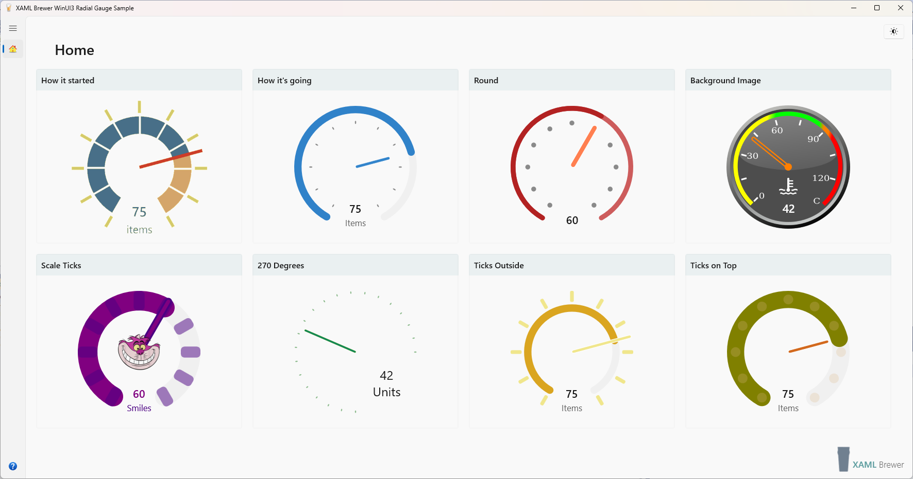

# XamlBrewer WinUI3 Radial Gauge Sample

Demonstrates the first official WinUI3/UWP/Uno version of the Community Toolkit Radial Gauge Control. Code is taken from its [initial Pull Request](https://github.com/CommunityToolkit/Windows/pull/45).

?raw=true)

